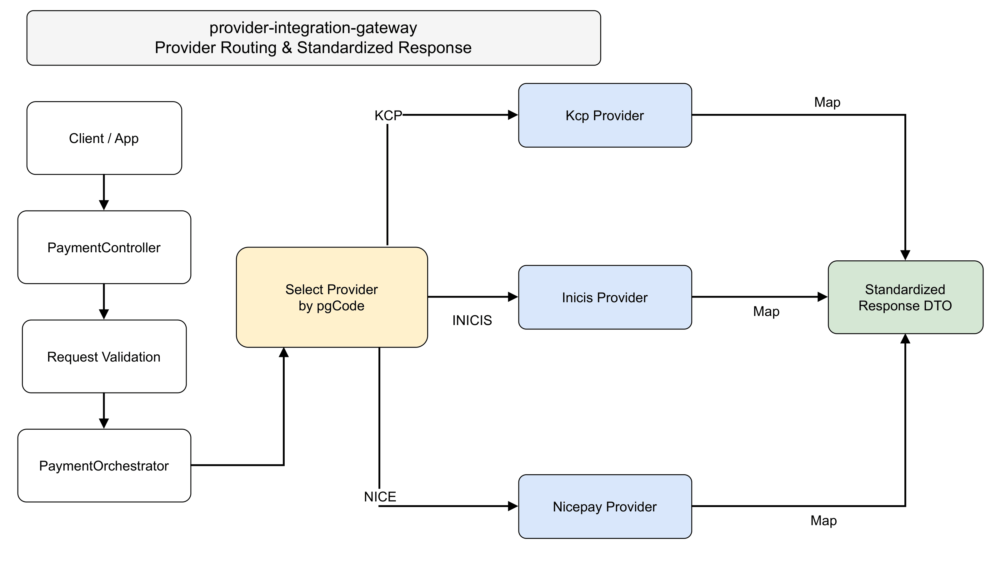
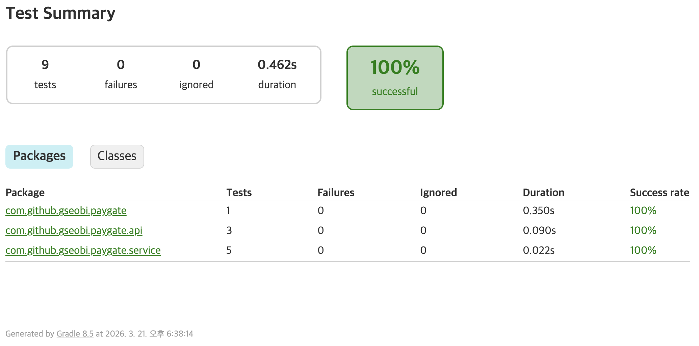
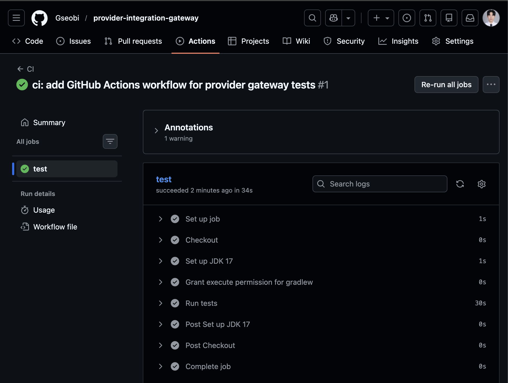
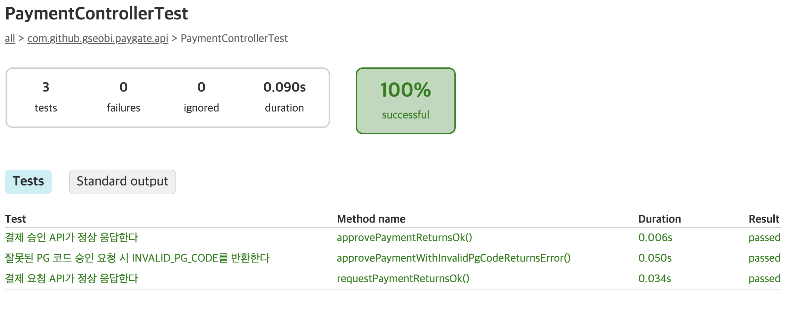
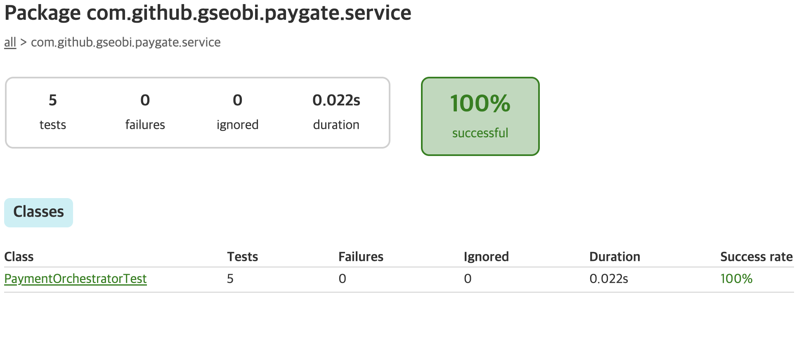
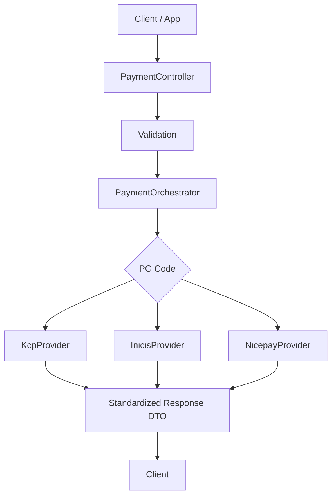

# provider-integration-gateway

다수의 외부 결제 Provider를 연동하는 환경에서 **Provider 선택, 요청 데이터 구성, 응답 표준화** 책임을 Backend 게이트웨이로 모은 결제 연동 프로젝트입니다.

실제 운영 환경에서 사용했던 PG 분기 전략과 책임 분리 구조를 바탕으로, 보안 및 계약 제약이 큰 외부 결제 연동 문제를 **Mock 기반 구조**로 재구성했습니다.

 

## 1. Quick Proof

- **Backend가 Provider 선택 책임을 가집니다.**
- **Provider별 요청 데이터 구성 책임을 Strategy Pattern으로 분리했습니다.**
- **Client에는 공통 Response DTO만 노출해 Provider 차이를 내부에서 흡수합니다.**
- **신규 Provider 추가 시 상위 계층 수정 범위를 최소화할 수 있는 구조를 목표로 했습니다.**

즉, 이 프로젝트는 단순 결제 API 구현보다 **분기 책임, 응답 표준화, 확장 가능한 구조**를 먼저 보여주는 Backend 게이트웨이 프로젝트입니다.

 

## 2. Execution Evidence

### Provider Routing Diagram

  

  
    Source:
    <a href="docs/diagrams/provider-routing-flow.drawio">draw.io</a> ·
    <a href="docs/pdf/provider-routing-flow.pdf">PDF</a>
  

 

### Verification Summary

| Scenario | Expected Behavior | Result | Evidence |
|---|---|---|---|
| Provider branching | PG code 기준으로 적절한 Strategy 선택 | Pass | `docs/test-report.md` |
| Provider request building | Provider별 요청 데이터 구성 분리 | Pass | `docs/test-report.md` |
| Common response DTO | 공통 응답 구조로 반환 가능 | Pass | `docs/test-report.md` |
| Unsupported provider handling | 지원하지 않는 PG 요청에 대해 예외 처리 | Pass | `docs/test-report.md` |
| Controller API verification | 결제 요청 / 승인 API 정상 동작 | Pass | `docs/test-report.md` |
| Extensible routing | Controller 수정 없이 Strategy 추가 중심 확장 가능 | Pass | `docs/test-report.md` |

### Test / CI Snapshot

<table width="100%">
  <tr>
    <td width="50%" align="center" valign="top">
      
    </td>
    <td width="50%" align="center" valign="top">
      
    </td>
  </tr>
  <tr>
    <td width="50%" align="center" valign="top">
      
    </td>
    <td width="50%" align="center" valign="top">
      
    </td>
  </tr>
</table>

### What This Proves

- PG code 기준 Provider 분기가 자동화 테스트로 검증되어 있습니다.
- Provider별 책임 분리와 공통 응답 반환 구조를 테스트 기준으로 설명할 수 있습니다.
- Mock 기반 구조이지만, 실무에서 중요한 **분기 책임 / 계약 표준화 / 확장성**을 증명하는 데 초점을 맞췄습니다.

 

## 3. Problem & Design Goal

다수의 결제 Provider를 연동하는 환경에서는 단순히 결제 요청을 보내는 것보다 아래 문제가 더 중요합니다.

- 어떤 Provider가 요청을 처리해야 하는가
- Provider별 요청 파라미터와 제약을 어디서 관리할 것인가
- Provider별 응답 차이를 어떻게 Client에 감출 것인가
- 신규 Provider 추가 시 기존 코드 수정 범위를 어떻게 줄일 것인가
- 실제 운영에서 민감한 연동 정보는 어떻게 분리할 것인가

이 프로젝트는 위 문제를 다음 방향으로 풀었습니다.

- **Backend**가 Provider 선택과 분기를 담당
- **Strategy Pattern**으로 Provider별 요청 구성 책임 분리
- **공통 Response DTO**로 Client 계약 표준화
- 실제 계약 및 보안 제약은 **Mock 기반 구조**로 대체

핵심은 결제 기능 자체보다, **Provider 차이를 Backend 내부에서 흡수하고 Client에는 안정적인 계약만 노출하는 구조**를 만드는 것입니다.

 

## 4. Key Design Points

### 1) Provider 선택 책임을 Backend에 집중

Client가 Provider별 분기 규칙까지 알게 되면 Client와 Server가 함께 복잡해집니다.

그래서 이 프로젝트는 다음 책임을 Backend 게이트웨이로 모았습니다.

- PG code 기준 Provider 선택
- 요청값 검증
- Provider별 요청 데이터 구성
- 후속 처리에 필요한 응답 데이터 반환

### 2) Strategy Pattern 기반 Provider 책임 분리

각 Provider는 요청값, 응답 형식, 제약 조건이 다르기 때문에 하나의 서비스에 조건문으로 누적 관리하지 않았습니다.

- `PaymentOrchestrator`: 전체 흐름 제어
- `PaymentProviderStrategy`: Provider별 구현 책임
- 신규 Provider 추가 시 상위 계층 수정 최소화

핵심은 패턴 적용 자체보다, **변경 포인트를 Provider 단위로 가두는 것**입니다.

### 3) 공통 Response DTO 중심의 외부 계약 유지

Provider마다 내부 응답은 달라도, Client는 가능한 한 같은 응답 구조를 받는 편이 안정적입니다.

- Provider 차이는 Backend 내부에서 흡수
- Client는 공통 Response DTO 기준으로 처리
- 이후 에러 응답 표준화도 같은 방향으로 확장 가능

 

## 5. Architecture / Flow

### Flow Summary

1. Client가 결제 요청을 전송합니다.
2. Controller가 요청을 수신하고 기본 검증을 수행합니다.
3. `PaymentOrchestrator`가 PG code 기준으로 Provider를 선택합니다.
4. 선택된 Provider가 해당 Provider 요청 데이터를 구성합니다.
5. Backend는 공통 Response DTO 형태로 결과를 반환합니다.
6. Client는 반환받은 데이터를 바탕으로 결제 화면 호출 또는 후속 승인 흐름을 진행합니다.

### High-Level Flow

### Main APIs

- `POST /api/payments/request`
- `POST /api/payments/approve/{pgCode}`

 

## 6. Tech Stack

- Java 17
- Spring Boot 3.2.1
- Spring Web
- Spring Validation
- REST API
- Strategy Pattern
- Mock Provider
- Gradle

 

## 7. Exception Handling / Extensibility

### Exception Handling

- **Validation Failure**
  - 필수값 누락, 형식 오류를 Provider 진입 전에 차단
- **Unsupported Provider**
  - 지원하지 않는 PG code는 즉시 실패 처리
- **Provider Mapping Failure**
  - Provider 선택과 구현체 연결 문제가 있을 경우 명확하게 실패 응답 반환
- **Provider Response Error**
  - 실제 운영에서는 timeout, 응답 누락, 형식 불일치를 Backend 내부에서 흡수해야 함
- **Retry Consideration**
  - 승인과 같이 멱등성이 민감한 작업은 무조건 재시도하지 않도록 구분 필요

### Extensibility

- 새로운 PG enum 또는 code 추가
- 신규 Provider Strategy 구현
- 요청 데이터 구성 로직 확장
- 공통 Response DTO 확장
- Provider별 에러 code 매핑 강화
- timeout / retry / circuit breaker 정책 도입
- traceId 기반 운영 추적 구조 추가

핵심은 **상위 계층을 자주 수정하지 않고 Provider 구현 단위에서 변경을 흡수하는 것**입니다.

 

## 8. Notes / Blog

### Project Docs

- [Design Notes](docs/design-notes.md)
- [Test Report](docs/test-report.md)
- [Error Handling Notes](docs/error-handling.md)

### Blog

이 프로젝트의 설계 배경과 운영 관점의 고민은 아래 글에 정리했습니다.

[여러 외부 Provider를 연동하는 Backend는 왜 Gateway 구조가 필요할까](https://velog.io/@wsx2386/%EC%97%AC%EB%9F%AC-%EC%99%B8%EB%B6%80-Provider%EB%A5%BC-%EC%97%B0%EB%8F%99%ED%95%98%EB%8A%94-Backend%EB%8A%94-%EC%99%9C-Gateway-%EA%B5%AC%EC%A1%B0%EA%B0%80-%ED%95%84%EC%9A%94%ED%95%A0%EA%B9%8C)

Keywords: `Multi-Provider Integration`, `Gateway Structure`, `Strategy Pattern`, `Response Standardization`, `External Integration`
