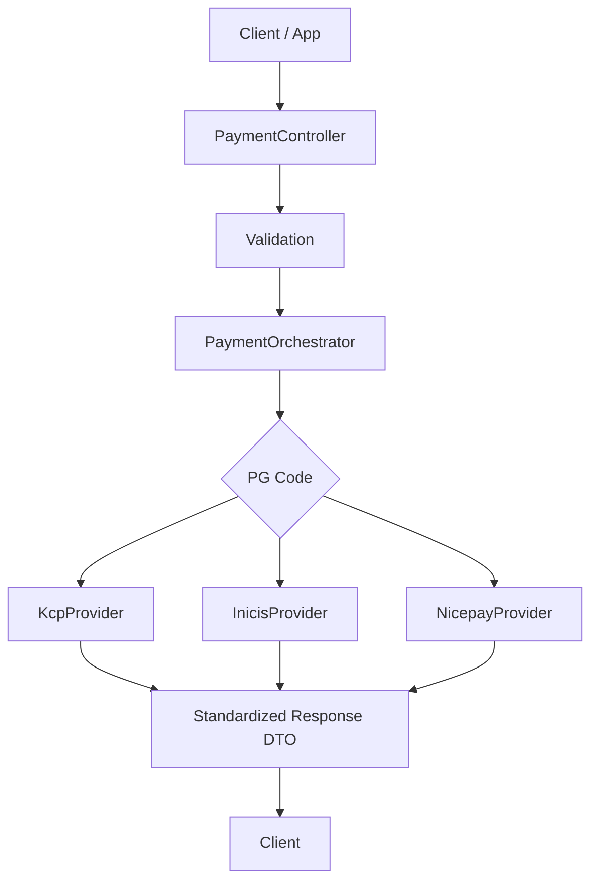

# provider-integration-gateway

다수의 외부 결제 Provider를 연동하는 환경에서 **Provider 선택, 요청 데이터 구성, 응답 표준화** 책임을 Backend 게이트웨이로 모은 결제 연동 프로젝트입니다.

 

## 1. Overview

이 프로젝트는 결제 연동을 단순 API 호출이 아니라 **분기 책임과 확장 비용을 통제하는 게이트웨이 문제**로 보고 재구성한 프로젝트입니다.

실제 운영 환경에서는 단일 결제창에 의존하기보다, 결제수단과 Provider 특성에 따라 Backend가 적절한 Provider를 선택하고 필요한 요청 데이터를 구성해 주는 역할이 중요했습니다.

이 프로젝트는 그 경험을 바탕으로, **Provider 차이를 Backend 내부에서 흡수하고 Client에는 안정적인 계약만 노출하는 구조**를 목표로 했습니다.

 

## 2. Problem This Project Solves

다수의 결제 Provider를 연동하는 환경에서는 단순히 결제 요청을 보내는 것보다 아래 문제가 더 중요해집니다.

- 어떤 Provider가 요청을 처리해야 하는가
- Provider별 요청 파라미터와 제약을 어디서 관리할 것인가
- Provider별 응답 차이를 어떻게 Client에 감출 것인가
- 신규 Provider 추가 시 기존 코드 수정 범위를 어떻게 줄일 것인가
- 실제 운영에서 민감한 연동 정보는 어떻게 분리할 것인가

이 프로젝트는 이러한 문제를 다음과 같이 풀어냅니다.

- **Backend**가 Provider 선택과 분기를 담당
- **Strategy Pattern**으로 Provider별 요청 구성 책임 분리
- **공통 Response DTO**로 Client 계약 표준화
- 실제 계약 및 보안 제약은 **Mock 기반 구조**로 대체

즉, 이 프로젝트는 결제 기능 구현보다 **분기 책임, 응답 표준화, 확장 가능한 구조**를 먼저 보여주는 Backend 게이트웨이 프로젝트입니다.

 

## 3. Key Design Points

### 1) Provider 선택 책임을 Backend에 집중

Client가 Provider별 분기 규칙까지 알게 되면 Client와 Server가 함께 복잡해집니다.

그래서 이 프로젝트는 다음 책임을 Backend 게이트웨이로 모았습니다.

- PG code 기준 Provider 선택
- 요청값 검증
- Provider별 요청 데이터 구성
- 후속 처리에 필요한 응답 데이터 반환

이렇게 하면 Client는 Provider 세부 구현보다 공통 계약 기준으로 흐름을 처리할 수 있습니다.

### 2) Strategy Pattern 기반 Provider 책임 분리

각 Provider는 요청값, 응답 형식, 제약 조건이 다르기 때문에 하나의 서비스에 조건문으로 누적 관리하지 않았습니다.

- `PaymentOrchestrator`: 전체 흐름 제어
- `PaymentProviderStrategy`: Provider별 구현 책임
- 신규 Provider 추가 시 상위 계층 수정 최소화

핵심은 패턴 적용 자체보다, **변경 포인트를 Provider 단위로 가두는 것**입니다.

### 3) 공통 Response DTO 중심의 외부 계약 유지

Provider마다 내부 응답은 달라도, Client는 가능한 한 같은 응답 구조를 받는 편이 안정적입니다.

- Provider 차이는 Backend 내부에서 흡수
- Client는 공통 Response DTO 기준으로 처리
- 이후 에러 응답 표준화도 같은 방향으로 확장 가능

이 구조를 통해 Client와 Provider 간 결합도를 낮추는 데 집중했습니다.

 

## 4. Architecture / Flow

### Flow Summary

1. Client가 결제 요청을 전송합니다.
2. Controller가 요청을 수신하고 기본 검증을 수행합니다.
3. `PaymentOrchestrator`가 PG code 기준으로 Provider를 선택합니다.
4. 선택된 Provider가 해당 Provider 요청 데이터를 구성합니다.
5. Backend는 공통 Response DTO 형태로 결과를 반환합니다.
6. Client는 반환받은 데이터를 바탕으로 결제 화면 호출 또는 후속 승인 흐름을 진행합니다.

### High-Level Flow

### Main APIs

- `POST /api/payments/request`
- `POST /api/payments/approve/{pgCode}`

### Design Direction

이 프로젝트는 `ModelAndView` 기반 화면 렌더링보다, **결제 요청에 필요한 JSON 데이터 반환 구조**에 더 초점을 두었습니다.

그 이유는 다음과 같습니다.

- Backend 책임을 UI 렌더링이 아니라 라우팅과 검증에 한정하기 위해
- Provider별 UI 차이를 Server가 직접 떠안지 않기 위해
- 테스트와 확장에 더 유리한 구조를 만들기 위해

 

## 5. Why These Technologies

### Java 17 + Spring Boot

REST API, Validation, 테스트 구성을 명확하게 가져가기 좋았습니다.  
게이트웨이 계층과 Provider 계층을 분리해 설명하기에도 적절했습니다.

### Strategy Pattern

Provider별 구현 차이를 분기 단위로 캡슐화하기 위해 선택했습니다.  
신규 Provider 추가 시 기존 Controller나 상위 흐름을 자주 수정하지 않도록 만드는 데 유리합니다.

### DTO + Validation

잘못된 요청을 Provider 호출 전에 차단하기 적합합니다.  
또한 Client 계약과 내부 구현을 분리하는 데 도움이 됩니다.

### Mock Provider

실제 결제 Provider 연동은 URL, 인증 키, 서명 규칙 등 민감한 요소를 포함합니다.  
포트폴리오에서는 실연동 자체보다 **구조와 책임 분리**를 보여주는 것이 더 중요하다고 판단해 Mock 기반으로 재구성했습니다.

### Tech Stack

- Java 17
- Spring Boot 3.2.1
- Spring Web
- Spring Validation
- REST API
- Strategy Pattern
- Mock Provider
- Gradle

 

## 6. Test / CI / Exception Handling

### Test Focus

이 프로젝트는 아래 시나리오를 중심으로 검증합니다.

- PG code 기준 Provider branching
- Provider별 요청 데이터 구성 분리
- 공통 Response DTO 반환
- unsupported provider 처리
- 결제 요청 / 승인 API 동작
- Controller 수정 없는 확장 가능 구조 확인

### CI

- GitHub Actions 기반 build / test 자동화
- 라우팅 구조와 API 동작에 대한 기본 회귀 확인 가능

### Exception Handling

- **Validation Failure**
  - 필수값 누락, 형식 오류를 Provider 진입 전에 차단
- **Unsupported Provider**
  - 지원하지 않는 PG code는 즉시 실패 처리
- **Provider Mapping Failure**
  - Provider 선택과 구현체 연결 문제가 있을 경우 명확하게 실패 응답 반환
- **Provider Response Error**
  - 실제 운영에서는 timeout, 응답 누락, 형식 불일치를 Backend 내부에서 흡수해야 함
- **Retry Consideration**
  - 승인과 같이 멱등성이 민감한 작업은 무조건 재시도하지 않도록 구분 필요

 

## 7. Extensibility

이 구조는 신규 Provider 추가를 고려해 설계했습니다.

- 새로운 PG enum 또는 code 추가
- 신규 Provider Strategy 구현
- 요청 데이터 구성 로직 확장
- 공통 Response DTO 확장
- Provider별 에러 code 매핑 강화
- timeout / retry / circuit breaker 정책 도입
- traceId 기반 운영 추적 구조 추가

핵심은 **상위 계층을 자주 수정하지 않고 Provider 구현 단위에서 변경을 흡수하는 것**입니다.

 

## 8. Blog / Notes

### Project Docs

- [Design Notes](docs/design-notes.md)
- [Test Report](docs/test-report.md)
- [Error Handling Notes](docs/error-handling.md)
